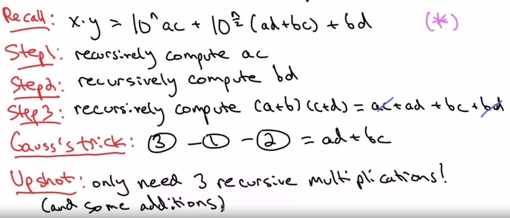

### Karatsuba Multiplication
x=5678
y=1234

a = 56
b = 78
c = 12
d = 34

Step 1: Compute a.c = 672
Step 2: compute b.d = 2652
Step 3: Compute (a+b).(c+d) = 134.46 = 6164
Step 4: (3) - (2) - (1)  = 2840
Step 5: 
        6720000
           2652
         284000
    ----------------
        7006652 = (1234).(5678)

### Recursive Algorithm
Write x = 10^(n/2).a + b and y = 10^(n/2).c + d
where a,b,c,d are n/2 - digit numbers
Example: a = 56, b = 78, c = 12, d = 34
Then: x.y = (10^(n/2).a + b).(10^(n/2).c + d)
          = (10^n).a.c + 10^(n/2).(a.d + b.c) + bd  //(*) //(Simple base case omitted)

Idea: Recursively compute ac, ad, bc, bd then compute (*) in a straight forward way.

